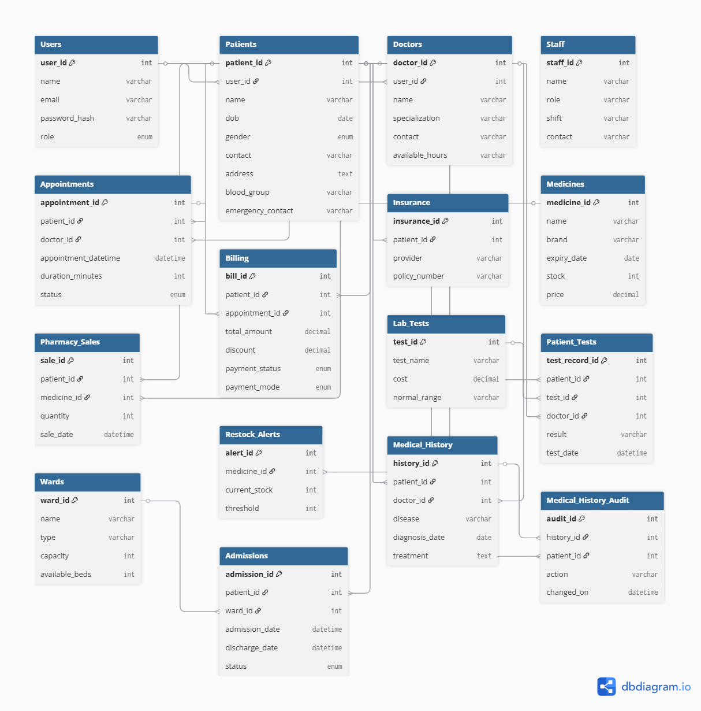

# 🏥 Smart Hospital Management System (SHMS) - MySQL Project

---

## 📌 Overview
The **Smart Hospital Management System (SHMS)** is a **MySQL database project** built to manage hospital operations digitally.  
It simulates a real-world hospital environment with **patients, doctors, staff, appointments, pharmacy, wards, insurance, and billing**.  
This project demonstrates **database design, normalization, stored procedures, triggers, views, and indexes** for performance and automation.  

---

## 🎯 Features
- ✅ **Normalized schema (3NF)** with 15+ tables  
- ✅ **10+ Stored Procedures** for reusable database logic  
- ✅ **10+ Triggers** for automation and consistency  
- ✅ **10+ Views** for analytics dashboards  
- ✅ **10+ Indexes** for query optimization  
- ✅ **Sample Data** to simulate hospital operations  
- ✅ Complete **ER Diagram**  

---

## 🗄️ Database Schema
ER Diagram:  

---

